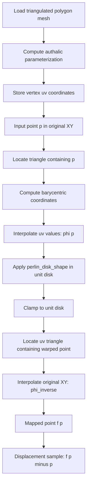

# Distortion Polygon Algorithm Overview

This document describes the current C++ sketch, including generation of a regular 2D array of complex displacement values over the original polygon domain.

The code assumes CGAL v6-style APIs are available. The current implementation is intentionally a sketch: triangle location is linear, the noise function is a dummy constant, and the sampled displacement field currently prints metadata rather than exporting to a file.

## Goal

Given a triangulated 2D polygon mesh embedded as `(x, y, 0)`, build a deformation function:

```text
f(p) = phi_inverse(F(phi(p)))
```

Where:

- `p` is a point in the original polygon.
- `phi` maps original polygon coordinates into the unit disk.
- `F` deforms points inside the unit disk using the Perlin-shaped disk function.
- `phi_inverse` maps the deformed disk point back to the original polygon.

The sampled-field artifact is a 2D array of complex numbers:

```text
field[i, j] = dx + i * dy = f(z) - z
```

This array samples the forward displacement field in original polygon XY space.

## Exact Map Pipeline

<svg width="820" height="180" viewBox="0 0 820 180" xmlns="http://www.w3.org/2000/svg" role="img" aria-label="Exact map pipeline">
  <defs>
    <marker id="arrow" viewBox="0 0 10 10" refX="8" refY="5" markerWidth="7" markerHeight="7" orient="auto-start-reverse">
      <path d="M 0 0 L 10 5 L 0 10 z" fill="#333" />
    </marker>
  </defs>
  <rect x="20" y="45" width="145" height="70" rx="6" fill="#f5f7fb" stroke="#4d6fa9" />
  <text x="92" y="74" text-anchor="middle" font-family="sans-serif" font-size="14">Original polygon</text>
  <text x="92" y="96" text-anchor="middle" font-family="monospace" font-size="13">p = (x, y)</text>
  <line x1="165" y1="80" x2="245" y2="80" stroke="#333" stroke-width="2" marker-end="url(#arrow)" />
  <text x="205" y="65" text-anchor="middle" font-family="monospace" font-size="13">phi</text>
  <circle cx="325" cy="80" r="50" fill="#fff7ed" stroke="#c26f2d" stroke-width="2" />
  <text x="325" y="74" text-anchor="middle" font-family="sans-serif" font-size="14">Unit disk</text>
  <text x="325" y="96" text-anchor="middle" font-family="monospace" font-size="13">q</text>
  <line x1="375" y1="80" x2="455" y2="80" stroke="#333" stroke-width="2" marker-end="url(#arrow)" />
  <text x="415" y="65" text-anchor="middle" font-family="monospace" font-size="13">F</text>
  <circle cx="535" cy="80" r="50" fill="#eefaf4" stroke="#3e8d64" stroke-width="2" />
  <path d="M 505 89 C 525 50, 552 50, 565 91" fill="none" stroke="#3e8d64" stroke-width="2" />
  <text x="535" y="74" text-anchor="middle" font-family="sans-serif" font-size="14">Warped disk</text>
  <text x="535" y="96" text-anchor="middle" font-family="monospace" font-size="13">q_prime</text>
  <line x1="585" y1="80" x2="665" y2="80" stroke="#333" stroke-width="2" marker-end="url(#arrow)" />
  <text x="625" y="65" text-anchor="middle" font-family="monospace" font-size="13">phi_inverse</text>
  <rect x="685" y="45" width="115" height="70" rx="6" fill="#f5f7fb" stroke="#4d6fa9" />
  <text x="742" y="74" text-anchor="middle" font-family="sans-serif" font-size="14">Polygon</text>
  <text x="742" y="96" text-anchor="middle" font-family="monospace" font-size="13">f(p)</text>
</svg>

## Mermaid Flowchart



## Algorithm 1: Load The Polygon Mesh

Current function: `load_triangulated_polygon`.

Inputs:

- Path to an OFF or polygon mesh file accepted by CGAL mesh IO.

Steps:

1. Read the mesh into `CGAL::Surface_mesh<Point_3>`.
2. Reject empty meshes.
3. Reject non-triangular meshes.
4. Return the mesh.

Expected mesh shape:

```text
vertices: (x, y, 0)
faces: triangles
boundary: one polygon border
```

## Algorithm 2: Compute Authalic Parameterization

Current function: `compute_authalic_parameterization`.

Purpose:

Map every mesh vertex from original polygon XY space to a 2D coordinate in the unit disk.

Steps:

1. Add a vertex property map named `v:uv`.
2. Find the longest boundary halfedge of the polygon mesh.
3. Use `Circular_border_arc_length_parameterizer_3` to place boundary vertices on the unit circle.
4. Use `Discrete_authalic_parameterizer_3` to solve for interior UV coordinates.
5. Return the UV property map.

Result:

```text
for each vertex v:
    mesh.point(v) gives original XY position
    uv_map[v] gives unit disk position
```

This UV map is used by both `phi` and `phi_inverse`.

## Algorithm 3: phi, Original Polygon To Unit Disk

Current function: `phi`.

Purpose:

Convert a point `p` from original polygon space into a disk point `q`.

Steps:

1. Locate the original mesh triangle containing `p`.
2. Compute barycentric coordinates of `p` inside that triangle.
3. Read the three UV coordinates of the triangle vertices from `uv_map`.
4. Interpolate those UV coordinates with the barycentric weights.
5. Return the interpolated disk point.

Formula:

```text
q = alpha * uv(v0) + beta * uv(v1) + gamma * uv(v2)
```

If no containing triangle is found, return no value.

## Algorithm 4: Perlin-Shaped Disk Deformation

Current function: `perlin_disk_shape`.

Purpose:

Deform a point inside the unit disk while keeping the disk boundary fixed.

Current implementation note:

`noise2D` is a dummy function and always returns `0.35`. The structure is ready to be replaced with real Perlin noise later.

Steps:

1. Compute disk radius `r`.
2. If `r` is nearly zero, return the center.
3. Compute a boundary falloff:

```text
falloff = r * pow(1 - r, falloff_power)
```

This makes displacement zero at the center and at the unit-circle boundary.

4. Sample noise channels:

```text
radial_noise   = noise2D(x * frequency, y * frequency)
rotation_noise = noise2D(x * frequency + offset_x, y * frequency + offset_y)
vector_x_noise = noise2D(... another offset ...)
vector_y_noise = noise2D(... another offset ...)
```

5. Apply radial displacement.
6. Apply angular rotation.
7. Apply small Cartesian vector displacement.
8. Return the deformed disk point.

Why the offsets exist:

They make each sampled effect use a different noise channel once `noise2D` becomes real Perlin noise. Without offsets, radial motion, rotation, X displacement, and Y displacement would all use the same value at the same point.

## Algorithm 5: phi_inverse, Unit Disk To Original Polygon

Current function: `phi_inverse`.

Purpose:

Convert a disk point `q_prime` back into original polygon XY space.

Steps:

1. Locate the UV triangle containing `q_prime`.
2. Compute barycentric coordinates of `q_prime` inside that UV triangle.
3. Read the three original XY coordinates of the same mesh triangle.
4. Interpolate the original XY coordinates with the barycentric weights.
5. Return the interpolated original-space point.

Formula:

```text
p_prime = alpha * xy(v0) + beta * xy(v1) + gamma * xy(v2)
```

If no containing UV triangle is found, return no value.

## Algorithm 6: Final Map

Current function: `final_map`.

Purpose:

Evaluate the exact pointwise deformation in original polygon coordinates.

Steps:

1. If the input point is on the polygon boundary, return it unchanged.
2. Compute `q = phi(point)`.
3. Apply `q_prime = perlin_disk_shape(q, settings)`.
4. Clamp `q_prime` to the unit disk for numerical safety.
5. Compute `point_prime = phi_inverse(q_prime)`.
6. Return `point_prime`.

Boundary behavior:

The exact path preserves boundary points by returning them unchanged before entering the disk map.

## Algorithm 7: Generate A 2D Complex Displacement Field

This implemented step creates the sampled array. It does not implement bilinear interpolation, point movement, segment movement, or hit testing.

<svg width="820" height="300" viewBox="0 0 820 300" xmlns="http://www.w3.org/2000/svg" role="img" aria-label="Displacement field grid sampling">
  <defs>
    <marker id="arrow2" viewBox="0 0 10 10" refX="8" refY="5" markerWidth="7" markerHeight="7" orient="auto-start-reverse">
      <path d="M 0 0 L 10 5 L 0 10 z" fill="#333" />
    </marker>
  </defs>
  <rect x="40" y="30" width="260" height="220" fill="#fbfbfb" stroke="#444" />
  <path d="M 85 205 L 112 78 L 214 55 L 264 130 L 225 218 Z" fill="#e8f3ff" stroke="#2f6690" stroke-width="2" />
  <g stroke="#c4c4c4" stroke-width="1">
    <line x1="80" y1="30" x2="80" y2="250" />
    <line x1="120" y1="30" x2="120" y2="250" />
    <line x1="160" y1="30" x2="160" y2="250" />
    <line x1="200" y1="30" x2="200" y2="250" />
    <line x1="240" y1="30" x2="240" y2="250" />
    <line x1="280" y1="30" x2="280" y2="250" />
    <line x1="40" y1="70" x2="300" y2="70" />
    <line x1="40" y1="110" x2="300" y2="110" />
    <line x1="40" y1="150" x2="300" y2="150" />
    <line x1="40" y1="190" x2="300" y2="190" />
    <line x1="40" y1="230" x2="300" y2="230" />
  </g>
  <circle cx="160" cy="150" r="5" fill="#111" />
  <line x1="160" y1="150" x2="205" y2="126" stroke="#d14" stroke-width="3" marker-end="url(#arrow2)" />
  <text x="158" y="170" text-anchor="middle" font-family="monospace" font-size="13">z</text>
  <text x="213" y="126" font-family="monospace" font-size="13">f(z)</text>
  <text x="170" y="275" text-anchor="middle" font-family="sans-serif" font-size="14">Sample grid over original polygon bounds</text>
  <rect x="380" y="60" width="380" height="160" rx="6" fill="#fffaf2" stroke="#b8792f" />
  <text x="570" y="92" text-anchor="middle" font-family="sans-serif" font-size="16">Stored field value</text>
  <text x="570" y="126" text-anchor="middle" font-family="monospace" font-size="15">field[i,j] = f(z) - z</text>
  <text x="570" y="158" text-anchor="middle" font-family="monospace" font-size="15">real = dx</text>
  <text x="570" y="184" text-anchor="middle" font-family="monospace" font-size="15">imag = dy</text>
  <text x="570" y="245" text-anchor="middle" font-family="sans-serif" font-size="14">Invalid samples outside the polygon use the validity mask</text>
</svg>

Inputs:

- `mesh`
- `uv_map`
- `Perlin_disk_shape_settings`
- `width`
- `height`

Command-line usage in the current sketch:

```text
./distortion_polygon [mesh_path] [width] [height]
```

Defaults:

```text
mesh_path = polygon.off
width = 64
height = 64
```

Data structures:

```cpp
struct Bounds_2 {
    double min_x;
    double min_y;
    double max_x;
    double max_y;
};

struct Displacement_field {
    Bounds_2 bounds;
    std::size_t width;
    std::size_t height;
    double step_x;
    double step_y;
    std::vector<std::complex<double>> values;
    std::vector<bool> valid;
};
```

Sampling steps:

1. Compute the polygon bounding box in original XY space.
2. Allocate `width * height` complex values.
3. Allocate `width * height` validity flags.
4. For each grid node `(i, j)`, compute its original-space position `z`.
5. Call `final_map(mesh, uv_map, z, settings)`.
6. If `final_map` succeeds, store:

```text
values[index] = complex(mapped.x - z.x, mapped.y - z.y)
valid[index] = true
```

7. If `final_map` fails, store zero displacement and mark:

```text
valid[index] = false
```

Indexing:

```text
index = j * width + i
```

Grid coordinate conversion:

```text
x = bounds.min_x + i * step_x
y = bounds.min_y + j * step_y
```

Where:

```text
step_x = (bounds.max_x - bounds.min_x) / (width - 1)
step_y = (bounds.max_y - bounds.min_y) / (height - 1)
```

## Scope Boundary

Included in the current implementation:

- Bounds computation.
- Complex displacement array allocation.
- Validity mask allocation.
- Sampling `final_map` into the array.
- Minimal console output for dimensions, bounds, step size, and valid sample count.

Out of scope for this implementation:

- Bilinear interpolation.
- Moving arbitrary points from the sampled field.
- Moving segments.
- Forward-hit tests against target points or segments.
- Rendering black source samples.
- True multivalued mapping.

## Notes About Multiple Source Samples

The sampled displacement field stores one displacement per source grid node. It is therefore a single-valued forward map.

Later, many source samples can still land on the same target point, pixel, or segment during forward-hit testing:

```text
z1 -> z_target
z2 -> z_target
z3 -> z_target
```

That behavior is not stored as multiple values in one grid cell. It appears when downstream code iterates over many source samples and checks where each displaced position lands.

## JavaScript Version

The file `distortion_polygon.js` implements the same sketch in dependency-free Node.js.

Main differences from the C++/CGAL sketch:

- It does not use CGAL.
- It reads triangulated OFF files directly in JavaScript.
- It reads SVG polygon input and triangulates it directly in JavaScript.
- It computes a disk parameterization with a Tutte/barycentric embedding instead of CGAL authalic parameterization.
- It stores the displacement field in typed arrays:
  - `Float64Array(width * height * 2)` for `dx, dy` pairs.
  - `Uint8Array(width * height)` for the validity mask.

Command-line usage:

```text
node distortion_polygon.js [mesh_path] [width] [height]
```

Defaults:

```text
mesh_path = polygon.off
width = 64
height = 64
```

Accepted JavaScript input formats:

- Triangulated OFF files.
- SVG files containing one `<polygon points="...">` element.
- SVG files containing one closed `<polyline points="...">` element.
- SVG files containing one closed line-only `<path d="...">` element using `M`, `L`, `H`, `V`, and `Z` commands. Relative lowercase commands are also supported.

SVG input is converted to a triangulated mesh before the disk parameterization step:

1. Extract the polygon vertices from `points` or `d`.
2. Remove a repeated closing vertex if present.
3. Normalize orientation to counter-clockwise.
4. Triangulate the simple polygon with ear clipping.
5. Build mesh adjacency and boundary edges from the generated triangles.

The Tutte embedding algorithm is:

1. Detect boundary edges from triangle edge counts.
2. Order the boundary into one loop.
3. Map boundary vertices to the unit circle by cumulative boundary edge length.
4. Build vertex adjacency from triangles.
5. For every interior vertex, solve the barycentric equation:

```text
uv(vertex) = average(uv(neighbor_0), uv(neighbor_1), ...)
```

6. Solve one dense linear system for `u` and another for `v`.
7. Reuse the same `phi`, `phi_inverse`, disk deformation, and displacement-field sampling pipeline.

This is simpler than authalic parameterization and is suitable for the pure JavaScript sketch. It is not expected to match CGAL's authalic UVs numerically.
